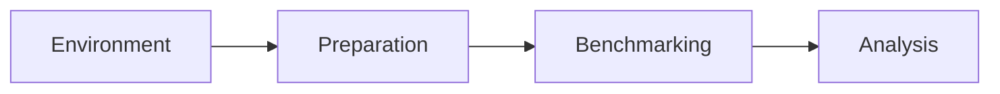

# Benchmark for Android crypto primitives

[](https://github.com/JuneKim0007/cryptobenchmark/actions/workflows/jca-contract.yml)

Measures JCA cryptographic primitives on Android devices.

## Pipeline



| Stage | Responsible for |
|---|---|
| Environment | discover providers and algorithms, check compatibility, check user customization, check the environment actually works |
| Preparation | read config for customized values, prepare input sets and keys |
| Benchmarking | run the benchmarks and write result files (Jetpack) |
| Analysis | compute metrics from the result files |

## Layout

| Module | Language | Holds |
|---|---|---|
| `:crypto` | Java | primitives, codec |
| `:environment:discovery` | Kotlin | provider adapter, contract, discovery setting |
| `:benchmark` | Java | input and key preparation |
| `:android` | Java | run config, instrumented benchmark classes |

File structure, language rule and dependency rules: [docs/docs.md](docs/docs.md).

## Scope

Benchmarking covers the generally used primitives. Catalogue:
[primitives](docs/cryptography/primitives.md), [providers](docs/cryptography/providers.md).

Target: Android 17 (API 37) on Pixel 9 (Tensor G4) and Pixel 10 (Tensor G5).
Comparison baseline: Android 16 (API 36).

| Primitive | Type |
|---|---|
| AES/GCM/NoPadding (12-byte IV) | symmetric-cipher |
| AES/CBC/PKCS5Padding | symmetric-cipher |
| AES/CTR/NoPadding | symmetric-cipher |
| ChaCha20, ChaCha20/Poly1305/NoPadding | symmetric-cipher |
| RSA/ECB/OAEPPadding, OAEPWithSHA-*AndMGF1Padding | asymmetric-cipher |
| RSA/ECB/PKCS1Padding | asymmetric-cipher |
| SHA-256, SHA-1, SHA-512 | hash |
| HmacSHA256, HmacSHA1 | mac |
| SHA256withRSA | signature |
| SHA256withECDSA (not yet measured) | signature |
| key generation for the above | keygen-symmetric, keygen-asymmetric |

Key sizes: AES 128/192/256, RSA 2048/4096, ECDSA P-256.

Out of scope: ML-DSA, ML-KEM, SLH-DSA, HPKE, X25519, ECDH, XDH, AES-CMAC, AES/GCM-SIV,
Ed25519, single DES, Blowfish, DSA.

MD5, 3DES and RC4 are measured as baselines only.

## Provider

| Provider | Provides |
|---|---|
| `AndroidOpenSSL` | Cipher, MessageDigest, Mac, Signature, KeyGenerator, KeyPairGenerator, KeyAgreement |
| `AndroidKeyStore` | KeyStore, KeyGenerator, KeyPairGenerator, KeyFactory, SecretKeyFactory |
| `AndroidKeyStoreBCWorkaround` | Cipher, Signature, Mac on AndroidKeyStore keys |
| `Conscrypt` (bundled) | same as `AndroidOpenSSL`, newer build |
| Bouncy Castle (bundled) | Cipher, MessageDigest, Mac, Signature, KeyGenerator, KeyPairGenerator |

See [docs/cryptography/providers.md](docs/cryptography/providers.md).

## Roadmap

| # | Step |
|---|---|
| 1 | Evaluate Jetpack Benchmark (`androidx.benchmark`) as the harness |
| 2 | Move to microbenchmarks — one case per measurement, R8 release build, `BlackHole` |
| 3 | Catalogue the providers available on Android (JCA), verify on device |
| 4 | Build the vertical pipeline: case → build → install → run → collect → validate |
| 5 | Refactor for generic use — primitives hold no registry or discovery; the case registry drives the sweep |

## Requirements

- python3
- Android SDK
- Java 8

Kotlin is not installed separately; the Gradle plugin fetches the compiler.

> :warning: Do not open the Android project with Android Studio. Recent versions do not
> support the Gradle version of this project and suggest changes that break the build.

## Installation

Install pyenv:

```
$ curl https://pyenv.run | bash
$ exec $SHELL
```

Install virtualenv:

```
$ python -m pip install --user virtualenv
```

Install the python version used for development:

```
$ pyenv install 3.10.12
```

Create and activate the virtualenv, then install the python packages:

```
$ virtualenv -p ~/.pyenv/versions/3.10.12/bin/python3.10 venv/
$ source venv/bin/activate
$ pip install -r requirements.txt
```

## Configuration

Benchmark settings live in `gradle.properties`. Each build turns them into
`BuildConfig` fields and writes `CryptoBenchmark.config`, which is pushed to the device and
read at run time.

| Key | Meaning |
|---|---|
| `KEY_LEN` | key size |
| `INPUT_SIZE` | input size in bytes |
| `N_TIMES` | times each cipher runs in each unit test |
| `PROVIDER` | crypto provider |
| `ALGORITHM` | algorithm under test |
| `MODE` | cipher mode |
| `PADDING` | cipher padding |
| `WARM_UP_TIME` | warm-up before each unit test |
| `COOL_DOWN_TIME` | cool-down after each unit test |
| `WITH_KEY_SPEC` | generate the key through `KeySpec` (required for some ciphers) |

`scripts/benchmark.py` sets these from command-line arguments.

## Execution

Via `run_benchmarks.sh` — define the primitives and params to benchmark at the end of the
file, then:

```
$ ./scripts/run_benchmarks.sh
```

Via `benchmark.py` — pass the config on the command line (`python3 scripts/benchmark.py --help`):

```
$ python3 scripts/benchmark.py -b -i -u -c MeasureSymmetricEncryptDecryptTest -nt $N_TIMES --n_test_times 30 -s 1 -is 1024
```

Each run rewrites `gradle.properties`, rebuilds, signs, installs, and runs the instrumented
tests `n_times`.

One instrumented test file per primitive holds one unit test per (algorithm, provider) pair.
Each unit test is annotated `@HunterDebug`, which records method start and end in the device
logs.

## Device setup

1. Use a factory-reset device or image. It must unlock without authentication.
2. Disable all sensors except Wi-Fi.
3. In Developer settings, enable USB debugging, view inspection, and install via USB.
4. Connect over Wi-Fi to the same network as the workstation:

    ```
    $ pyanadroid -sc WIFI
    ```

    Disconnect the USB cable and confirm the device is listed:

    ```
    $ adb devices -l
    List of devices attached
    15bb8bd3	device
    192.168.1.196:5555	device
    ```

5. Configure `scripts/run_benchmarks.sh` and start the run.

## Notes

- The project is an Android application, not a library: instrumentation plugins do not work
  for Android libraries. It has no Activities.
- Every (algorithm, provider) pair gets its own named unit test, because instrumentation
  records only the method name.
