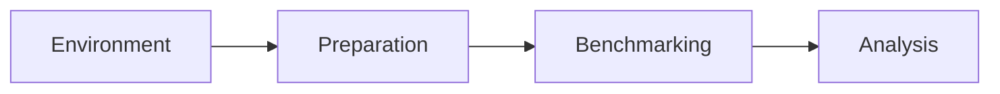

# Benchmark for Android crypto primitives

[](https://github.com/JuneKim0007/cryptobenchmark/actions/workflows/jca-contract.yml)

Measures JCA cryptographic primitives on Android devices.

## Pipeline



| Stage | Responsible for |
|---|---|
| Environment | discover providers and algorithms, check compatibility, check user customization, check the environment actually works |
| Preparation | read config for customized values, prepare input sets and keys |
| Benchmarking | run the benchmarks and write result files (Jetpack) |
| Analysis | compute metrics from the result files |

## Layout

| Module | Language | Holds |
|---|---|---|
| `:environment:discovery` | Kotlin | provider adapter, contract, trial, query |
| `:config` | Kotlin | `effective.yaml` from the capture, the trial and the authored `config/` |
| `:preparation` | Kotlin | `effective.yaml` + capture + trial → cases, keys, bound parameters |
| `:benchmark` | — | Jetpack harness *(planned, #33)* |
| `:android` | Java | app shell; the harness lands here with #33 |

Every module reads YAML and writes YAML; none imports another module's classes.
`tools/module-isolation` compiles each one alone and runs it against its own `example/` files.

File structure, language rule and dependency rules: [docs/docs.md](docs/docs.md).

## Scope

Benchmarking covers the generally used primitives. Catalogue:
[primitives](docs/cryptography/primitives.md), [providers](docs/cryptography/providers.md).

Target: Android 17 (API 37) on Pixel 9 (Tensor G4) and Pixel 10 (Tensor G5).
Comparison baseline: Android 16 (API 36).

| Primitive | Type |
|---|---|
| AES/GCM/NoPadding (12-byte IV) | symmetric-cipher |
| AES/CBC/PKCS5Padding | symmetric-cipher |
| AES/CTR/NoPadding | symmetric-cipher |
| ChaCha20, ChaCha20/Poly1305/NoPadding | symmetric-cipher |
| RSA/ECB/OAEPPadding, OAEPWithSHA-*AndMGF1Padding | asymmetric-cipher |
| RSA/ECB/PKCS1Padding | asymmetric-cipher |
| SHA-256, SHA-1, SHA-512 | hash |
| HmacSHA256, HmacSHA1 | mac |
| SHA256withRSA | signature |
| SHA256withECDSA (not yet measured) | signature |
| key generation for the above | keygen-symmetric, keygen-asymmetric |

Key sizes: AES 128/192/256, RSA 2048/4096, ECDSA P-256.

Out of scope: ML-DSA, ML-KEM, SLH-DSA, HPKE, X25519, ECDH, XDH, AES-CMAC, AES/GCM-SIV,
Ed25519, single DES, Blowfish, DSA.

MD5, 3DES and RC4 are measured as baselines only.

## Provider

| Provider | Provides |
|---|---|
| `AndroidOpenSSL` | Cipher, MessageDigest, Mac, Signature, KeyGenerator, KeyPairGenerator, KeyAgreement |
| `AndroidKeyStore` | KeyStore, KeyGenerator, KeyPairGenerator, KeyFactory, SecretKeyFactory |
| `AndroidKeyStoreBCWorkaround` | Cipher, Signature, Mac on AndroidKeyStore keys |
| `Conscrypt` (bundled) | same as `AndroidOpenSSL`, newer build |
| Bouncy Castle (bundled) | Cipher, MessageDigest, Mac, Signature, KeyGenerator, KeyPairGenerator |

See [docs/cryptography/providers.md](docs/cryptography/providers.md).

## Roadmap

| # | Step |
|---|---|
| 1 | Evaluate Jetpack Benchmark (`androidx.benchmark`) as the harness |
| 2 | Move to microbenchmarks — one case per measurement, R8 release build, `BlackHole` |
| 3 | Catalogue the providers available on Android (JCA), verify on device |
| 4 | Build the vertical pipeline: case → build → install → run → collect → validate |
| 5 | Refactor for generic use — primitives hold no registry or discovery; the case registry drives the sweep |

## Requirements

- Java 17 (host tools), Android SDK (API check)
- Java 8 + Gradle 6.5 for the legacy app module, until #33

Kotlin is not installed separately; the Gradle plugin fetches the compiler.

## Run, on the host

```
python3 scripts/pipeline.py                      # probe -> trial -> inventory -> effective
python3 scripts/pipeline.py --bench              # and prepare -> measure -> analyse (JVM, until #33)
python3 scripts/pipeline.py --discovery reuse    # keep this device's capture, skip probing
python3 scripts/pipeline.py --bench --stream     # show each tool's progress while it runs
```

Writes `results/discovery/{probe,probe_classes,trial}_<utc>.yaml`, `results/configuration/{inventory,effective}.yaml`,
and with `--bench` also `results/benchmark/benchmark.json` and `results/analysis/`.
What to measure is `config/global.yaml` and `config/testsets/`; `--config` takes another one.

## Demo

```
scripts/demo.sh --warm     # compile both tools first, so a live run has nothing to build
scripts/demo.sh            # 11 primitives, 56 cases, about 30s
scripts/demo.sh --fast     # 3 primitives, 4 cases, about 9s
scripts/demo.sh --reuse    # keep this device's capture instead of probing again
```

| Stage | Config | Typical |
|---|---|---|
| discover and configure | `config/global-quick.yaml` | 3s |
| prepare and measure | `config/testsets/quick.yaml` | 23s |
| analyse | — | 1s |

Output goes to `results/demo/`, so an earlier run under `results/` survives a live re-run.

## Device

Blocked on #33: the harness moves to Jetpack Microbenchmark with AGP 8 / Gradle 8 / Java 17.
