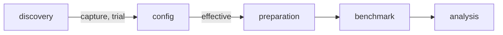

# Benchmark for Android crypto primitives

[](https://github.com/JuneKim0007/cryptobenchmark/actions/workflows/jca-contract.yml)
[](https://github.com/JuneKim0007/cryptobenchmark/actions/workflows/modules.yml)

Measures the JCA cryptographic primitives an Android device actually provides — what is registered,
what really runs, and how fast.

## How it works



| Module | Does |
|---|---|
| `:environment:discovery` | lists every provider and service the device registers, and calls each once to see what runs |
| `:config` | crosses what the device runs with the authored `config/` into `effective.yaml`, the one file a run reads |
| `:preparation` | turns `effective.yaml` into cases — keys, inputs, parameters — and calls each once before any timer |
| `:benchmark` | the timed run on the device, Jetpack Microbenchmark *(planned, #33)* |

Modules talk only through YAML files; none imports another. Each is built and tested alone
against its own `example/` files (`tools/module-isolation`).

## Scope

AES, ChaCha20, RSA, SHA-2, HMAC, ECDSA and their key generation, on Pixel 9 and Pixel 10.
Catalogue: [primitives](docs/cryptography/primitives.md), [providers](docs/cryptography/providers.md).

## Run, on the host

```
python3 scripts/pipeline.py              # discover and configure
python3 scripts/pipeline.py --bench      # and prepare, measure, analyse (JVM stand-in until #33)
scripts/demo.sh --fast                   # the whole flow on three primitives, about 9s
```

What to measure: `config/global.yaml` and `config/testsets/`. Output: `results/`.
Requires Java 17; the Gradle plugin fetches Kotlin.

## Docs

File structure, language and dependency rules: [docs/docs.md](docs/docs.md). Each module's README
lists its files; its `docs/` explains how it works.
